# Arquitectura Técnica - PRISMA v5

> Diseño del sistema, componentes y especificaciones técnicas

---

## 🏗️ Visión General del Sistema

PRISMA v5 es un sistema de presentaciones interactivas B2B que combina:

- **Backend API** (Express + TypeScript + JSON Storage)
- **Frontend Cliente** (Next.js + Shadcn/ui)
- **Backoffice Admin** (Next.js + Dashboard)
- **Integraciones IA** (Claude/OpenAI + TTS/STT)

---

## 🎭 Componentes Principales

### 1. Backoffice (Panel Administrativo)

#### Propósito
Panel de gestión para crear, editar y administrar presentaciones comerciales.

#### Funcionalidades Principales
- **Autenticación**: Login único con admin/admin123
- **Gestión de Clientes**: CRUD completo con datos de contacto y analytics
- **Gestión de Presentaciones**: CRUD completo con sistema de duplicación
- **Editor WYSIWYG**: Editor de bloques moderno estilo Notion/WordPress
- **Editor Inteligente**: Chatbot para crear páginas basado en briefings (PDF/texto)
- **Gestión de Tokens**: Crear, configurar y revocar accesos de clientes
- **Analytics Dashboard**: Métricas de engagement y detección de hot leads
- **Gestión de Corpus**: Subida y organización de contenido contextual

#### Flujo de Trabajo Típico
1. **Login** como administrador
2. **Crear presentación** usando plantillas o chatbot con briefing
3. **Configurar corpus** específico para la presentación
4. **Generar token** con permisos y límites específicos
5. **Compartir URL** con token al cliente
6. **Monitorear analytics** y detectar hot leads

### 2. Frontend de Presentaciones (Cliente)

#### Propósito
Interfaz para que los clientes visualicen presentaciones comerciales de forma inmersiva.

#### Características de Diseño
- **Pantalla completa** con márgenes de seguridad
- **Responsive design** adaptable a todos los dispositivos
- **Estilo Apple-like**: Poco texto, mucho impacto visual
- **Navegación intuitiva** con múltiples métodos de control

#### Modos de Presentación

**Modo Normal (Manual)**
- Navegación por teclado (←→, espacio, enter)
- Click en áreas de navegación
- Barra de progreso discreta
- Chat lateral siempre disponible

**Modo Narrado (Automático)**
- Reproducción automática con TTS
- Controles de pausa/play/velocidad
- Sistema "levantar mano" para preguntas
- Respuestas por voz con STT

#### Controles y Navegación
```typescript
interface NavigationControls {
  keyboard: ["ArrowLeft", "ArrowRight", "Space", "Enter"];
  mouse: ["click_zones", "scroll_wheel"];
  touch: ["swipe_left", "swipe_right", "tap"];
  voice: ["siguiente", "anterior", "pausa", "pregunta"];
}
```

### 3. Backend API

#### Arquitectura
```typescript
// Estructura del servidor
const server = {
  runtime: "Node.js 20+ LTS",
  language: "TypeScript 5+",
  framework: "Express.js",
  middleware: ["Helmet", "CORS", "Morgan", "JWT"],
  persistence: "JSON File Storage",
  testing: "Jest + Supertest"
};
```

#### Endpoints Principales
- **Autenticación**: `/api/auth/*`
- **Presentaciones**: `/api/presentations/*`
- **Analytics**: `/api/analytics/*`
- **Health Check**: `/health`

---

## 🎨 Sistema de Diseño

### Branding PRISMA

#### Paleta de Colores
```typescript
const prismaColors = {
  primary: "#DC2626",      // Rojo PRISMA
  secondary: "#000000",    // Negro
  background: "#FFFFFF",   // Blanco
  text: "#000000",         // Negro para texto
  muted: "#6B7280",        // Gris medio
  light: "#F3F4F6",        // Gris claro
  dark: "#374151",         // Gris oscuro
};
```

#### Tipografía
```css
/* Fuente principal */
font-family: 'Inter', sans-serif;

/* Jerarquía */
h1: 2.5rem;    /* 40px */
h2: 2rem;      /* 32px */
h3: 1.5rem;    /* 24px */
body: 1rem;    /* 16px */
caption: 0.875rem; /* 14px */
```

### Estilos de Aplicación (PRISMA Branding)

La interfaz del sistema (backoffice y controles del frontend):
- **Componentes Shadcn/ui** con tema PRISMA personalizado
- **Paleta**: Neutros + Rojo PRISMA (#DC2626) como color de acento
- **Tipografía**: Inter como fuente principal
- **Iconos**: Lucide React (nativos del stack)
- **Logo**: PRISMA en header/sidebar, "TodoSeTransforma by + logo Digitis" en footer
- **Comportamiento**: Autohide de controles tras 5 segundos sin movimiento del ratón
- **Filosofía**: UI profesional con identidad PRISMA sutil pero presente

### Estilos de Presentaciones (Corporativo Unificado)

Todas las presentaciones compartirán el mismo estilo corporativo:
- **Colores corporativos**: Rojo PRISMA, negro y escala de grises
- **Tipografía**: Consistente en todas las presentaciones
- **Iconos**: Material Design Two Tone como estándar
- **Branding**: Logo e icono PRISMA
- **Consistencia**: Mismo look & feel en todas las presentaciones

### Sistema de Iconos

#### Iconos de UI (Aplicación)
```typescript
// Lucide React - Iconos nativos del stack
import { 
  Home, Settings, User, BarChart3, Plus, Trash2,
  Eye, MessageCircle, Mic, Download, Edit, Save
} from 'lucide-react';

interface UIIcons {
  library: "Lucide React";
  integration: "Componentes React nativos";
  usage: "Backoffice y controles del frontend";
  style: "Neutro, minimalista, optimizado para web";
  performance: "Tree shaking, sin fuentes externas";
}
```

#### Iconos de Presentaciones (Corporativo)
```typescript
// Material Design Two Tone
interface PresentationIcons {
  library: "Material Design Two Tone";
  implementation: "@mui/icons-material/TwoTone";
  usage: "Elementos de slides (keypoints, metrics, highlights)";
  style: "Corporativo, consistente, bicolor";
  examples: [
    "BusinessTwoTone",      // Negocios
    "TrendingUpTwoTone",    // Métricas
    "LightbulbTwoTone",     // Ideas
    "SecurityTwoTone",      // Seguridad
    "SpeedTwoTone",         // Performance
    "GroupTwoTone"          // Equipo
  ];
  colors: {
    primary: "#DC2626";     // Rojo PRISMA
    secondary: "#6B7280";   // Gris medio
  };
}
```

---

## 📝 Editor WYSIWYG de Slides

### Arquitectura del Editor

```typescript
interface SlideEditor {
  type: "Block-based Editor";  // Estilo Notion/WordPress Gutenberg
  layout: {
    sidebar: "Bloques disponibles (drag to add)";
    center: "Editor con preview en tiempo real";
    properties: "Panel de configuración del bloque seleccionado";
    toolbar: "Acciones globales (guardar, preview, plantillas)";
  };
  
  blocks: {
    text: "Párrafos con estilos intro/body/caption";
    heading: "Títulos H1, H2, H3 con tipografía corporativa";
    highlight: "Destacados con iconos Material Design y variantes de color";
    keypoints: "Listas con iconos, layout grid opcional";
    metrics: "Estadísticas con valores animados";
    quote: "Citas elegantes con autor";
    image: "Imágenes con caption y posicionamiento";
    link: "Enlaces contextuales para chat";
    spacer: "Espaciado vertical configurable";
  };
  
  features: {
    dragDrop: "Reordenar bloques arrastrando";
    livePreview: "Vista previa en tiempo real";
    templates: "Plantillas de slides predefinidas";
    duplicate: "Duplicar bloques y slides completos";
    undoRedo: "Historial de cambios";
    shortcuts: "Atajos de teclado para productividad";
    validation: "Validación automática de contenido";
  };
}
```

### Dependencias del Editor

```typescript
const editorDependencies = {
  "@blocknote/core": "^0.15.0",        // Motor del editor de bloques
  "@blocknote/react": "^0.15.0",       // Componentes React
  "@dnd-kit/core": "^6.1.0",           // Drag & Drop core
  "@dnd-kit/sortable": "^8.0.0",       // Reordenar elementos
  "@dnd-kit/utilities": "^3.2.2",      // Utilidades DnD
  "react-live": "^4.1.6",              // Preview dinámico
  "@mui/icons-material": "^5.15.0",    // Material Design Icons
  "framer-motion": "^10.18.0",         // Animaciones suaves
};
```

---

## 🔄 Flujos de Usuario

### Flujo Administrador (Backoffice)

```mermaid
graph TD
    A[Login admin/admin123] --> B[Dashboard Principal]
    B --> C{Acción deseada}
    C -->|Nueva Presentación| D[Crear con Plantilla]
    C -->|Nueva Presentación| E[Crear con Chatbot IA]
    C -->|Gestionar Existente| F[Lista Presentaciones]
    C -->|Analytics| G[Dashboard Métricas]
    
    D --> H[Editor JSON]
    E --> I[Upload Briefing] --> J[IA Genera Slides] --> H
    H --> K[Configurar Corpus]
    K --> L[Generar Token]
    L --> M[Compartir URL]
    
    F --> N[Editar/Eliminar]
    G --> O[Hot Leads] --> P[Notificaciones]
```



### Flujo Cliente (Frontend)

```mermaid
graph TD
    A[Acceso URL con Token] --> B{Token Válido?}
    B -->|No| C[Pantalla Expiración]
    B -->|Sí| D[Pantalla Carga]
    D --> E[Presentación Cargada]
    E --> F{Modo Seleccionado}
    
    F -->|Normal| G[Navegación Manual]
    F -->|Narrado| H[Reproducción Automática]
    
    G --> I[Ver Slides]
    I --> J[Click Enlaces Contextuales] --> K[Minichatbot]
    I --> L[Chat Lateral] --> M[IA Responde]
    I --> S[Llegar a Contraportada] --> T[Sistema Call-to-Action]
    
    H --> N[Escuchar Narración]
    N --> O[Levantar Mano] --> P[Hacer Pregunta Voz]
    P --> Q[IA Responde Audio]
    N --> S
    
    T --> U{Acción Elegida}
    U -->|Aceptar Propuesta| V[Formulario Aceptación] --> W[Email URGENTE a Vendedor]
    U -->|Solicitar Reunión| X[Formulario Disponibilidad] --> Y[Email + Calendario]
    U -->|Pedir Llamada| Z[Formulario Contacto] --> AA[Email + Notificación]
    U -->|Más Info| BB[Formulario Consulta] --> CC[Email + Seguimiento]
    U -->|Generar Documento| DD[Comandos IA] --> EE[Artefacto PDF]
    
    K --> R[Analytics Tracking]
    M --> R
    Q --> R
    W --> R
    Y --> R
    AA --> R
    CC --> R
    EE --> R
```



---

## 🛡️ Seguridad

### Autenticación JWT

```typescript
interface SecurityMeasures {
  authentication: {
    method: "JWT (JSON Web Tokens)";
    expiration: "24 hours";
    secret: "Environment variable";
    algorithm: "HS256";
  };
  
  authorization: {
    roles: ["ADMIN", "USER"];
    middleware: "Role-based access control";
    tokenValidation: "Every protected route";
  };
  
  dataProtection: {
    passwords: "bcrypt hashing";
    tokens: "Signed and time-limited";
    cors: "Restricted origins";
    helmet: "Security headers";
  };
}
```

### Protección de Endpoints

```typescript
// Middleware de autenticación
const authenticateToken = (req, res, next) => {
  const token = req.headers.authorization?.split(' ')[1];
  if (!token) return res.status(401).json({ error: 'Token required' });
  
  jwt.verify(token, process.env.JWT_SECRET, (err, user) => {
    if (err) return res.status(403).json({ error: 'Invalid token' });
    req.user = user;
    next();
  });
};

// Middleware de roles
const requireAdmin = (req, res, next) => {
  if (req.user.role !== 'ADMIN') {
    return res.status(403).json({ error: 'Admin access required' });
  }
  next();
};
```

---

## 📊 Performance

### Optimizaciones Implementadas

```typescript
interface PerformanceOptimizations {
  frontend: {
    turbopack: "10x faster builds than Webpack";
    treeshaking: "Lucide React icons only load used icons";
    codesplitting: "Next.js automatic route-based splitting";
    imageOptimization: "Next.js Image component with WebP";
  };
  
  backend: {
    jsonStorage: "Direct file system access, no DB overhead";
    caching: "In-memory caching for frequently accessed data";
    compression: "Gzip compression for API responses";
    gracefulShutdown: "Proper cleanup on server termination";
  };
  
  assets: {
    svgLogos: "Vector graphics for scalability";
    webpImages: "Modern image format support";
    fontSubsetting: "Only load required font weights";
  };
}
```

---

## 🧪 Testing Strategy

### Backend Testing

```typescript
// Jest + Supertest para API testing
describe('Auth Endpoints', () => {
  test('POST /api/auth/login - valid credentials', async () => {
    const response = await request(app)
      .post('/api/auth/login')
      .send({
        email: 'admin@prisma.com',
        password: 'admin123'
      });
    
    expect(response.status).toBe(200);
    expect(response.body.success).toBe(true);
    expect(response.body.data.token).toBeDefined();
  });
});
```

### Frontend Testing

```typescript
// Vitest + Testing Library para componentes
import { render, screen } from '@testing-library/react';
import { PresentationCard } from './PresentationCard';

test('renders presentation title', () => {
  render(<PresentationCard title="Test Presentation" />);
  expect(screen.getByText('Test Presentation')).toBeInTheDocument();
});
```

---

*Arquitectura Técnica v1.3 - Actualizada el 7 de agosto de 2025*
